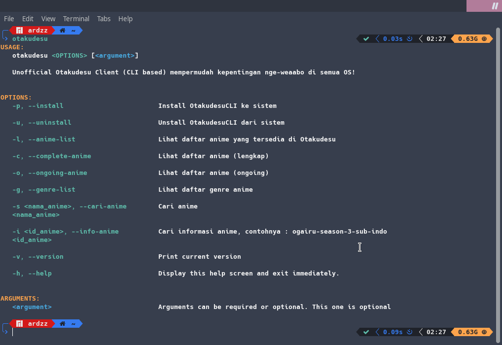
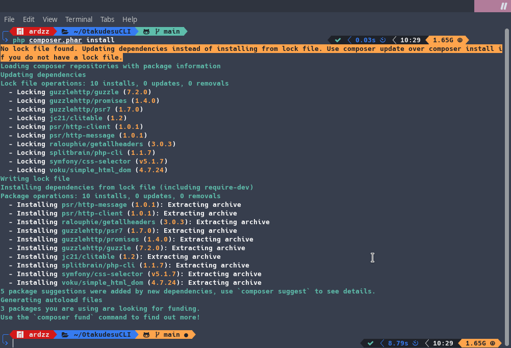
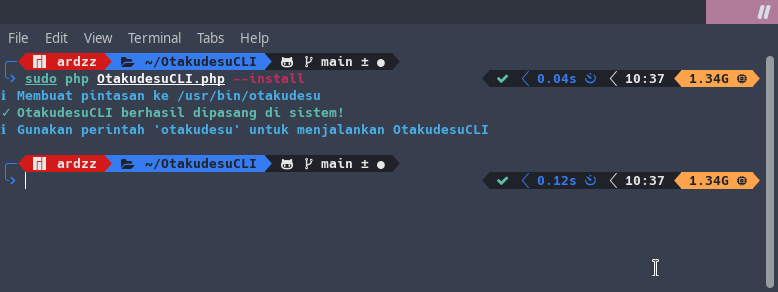

# OtakudesuCLI
Unofficial Otakudesu Client (_CLI based_) mempermudah kepentingan nge-_weaaboo_ di semua OS!


[Donasi di Trakteer.id](https://trakteer.id/ardhan)



#### Requirements
- PHP7 or above
- PHP-cURL library

**Disarankan untuk menggunakan terminal yang support warna**

#### Instalasi
```bash
# Clone repositori
git clone https://github.com/ardzz/OtakudesuCLI

# Pergi ke folder OtakudesuCLI
cd OtakudesuCLI

# Install semua dependencies menggunakan composer portable
php composer.phar install

# Jalankan OtakudesuCLI
php OtakudesuCLI.php

# Install OTakudesuCLI ke sistem (OPSIONAL)
sudo php OtakudesuCLI.php --install
```
- Screenshot Instalasi
  - Install semua dependencies
     
  - Install OtakudesuCLI ke sistem
     
